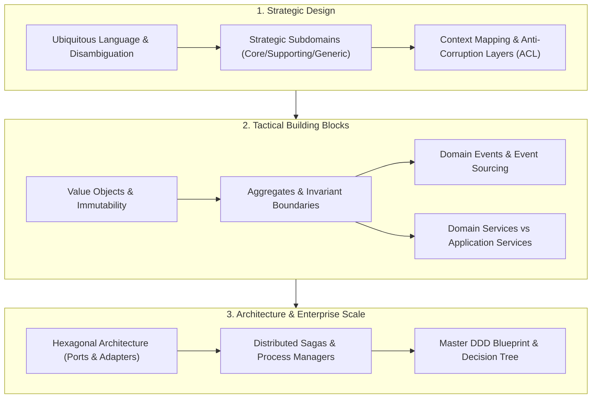

# Apex Domain-Driven Design Lab 🏛️

[](https://nextjs.org/)
[](https://react.dev/)
[](https://openjdk.org/)
[](https://go.dev/)
[](http://localhost:3017)
[](https://www.w3.org/WAI/standards-guidelines/wcag/)
[](LICENSE)

> A state-of-the-art interactive engineering laboratory and curriculum mastering **Domain-Driven Design (DDD)** from **beginner fundamentals to enterprise-scale distributed systems**, featuring a real-time polyglot code engine (**Java 26+ $\leftrightarrow$ Go 1.24**) and bleeding-edge web standards.

---

## 🧭 Curriculum & Interactive Studios

The laboratory contains **10 in-depth interactive studios** spanning the entire Domain-Driven Design spectrum:



### Studio Breakdown

| Studio | Level | Core DDD Concepts | Interactive Simulation |
| :--- | :--- | :--- | :--- |
| **1. Ubiquitous Language & Domain Modeling** | Level 1 | Anemic vs Rich models, Linguistic Ambiguity, Context Glossaries | Contextual Term Disambiguation & Invariant Mutation Sandbox |
| **2. Strategic Subdomains & Core Distillation** | Level 2 | Core vs Supporting vs Generic subdomains, Investment Matrix | Strategic Subdomain Classifier & ROI Matrix Simulator |
| **3. Bounded Contexts & Context Mapping** | Level 2 | 7 Integration Patterns: Shared Kernel, Customer/Supplier, Conformist, ACL, OHS, PL | Interactive Context Topology Graph & ERP Translation Sandbox |
| **4. Value Objects & Primitive Obsession** | Level 3 | Value Objects, Structural Equality, Immutability, Self-Validation | Multi-Currency & Money Arithmetic Simulator with Rounding Protection |
| **5. Entities, Invariants & Aggregate Roots** | Level 3 | Entity Identity, Aggregate Consistency Boundary, Rule of One Tx | Order & LineItems Aggregate State Machine with Invariant Enforcement |
| **6. Domain Events & Event Sourcing** | Level 3 | Past-tense Business Events, Event Sourced Aggregates | Append-Only Event Store & Time-Travel State Reconstitution Slider |
| **7. Domain Services vs Application Services** | Level 3 | Stateless domain logic vs Application Orchestration | Multi-Currency Cross-Border Settlement & Tax Nexus Engine |
| **8. Hexagonal Architecture (Ports & Adapters)** | Level 4 | Inbound/Outbound Ports, Zero-Dependency Core, Driving/Driven Adapters | Interactive 3-Ring Concentric Layer Inspector |
| **9. Distributed Sagas & Process Managers** | Level 5 | Orchestration vs Choreography, Long-running transactions, Compensations | E-Commerce Checkout Saga with Forward Steps & Chaos Failure Rollbacks |
| **10. Master DDD Blueprint & Decision Wizard** | Level 5 | 5-Level Mastery Roadmap, Decision Tree, Team Maturity Checklist | Interactive Architecture Decision Wizard & Maturity Meter |

---

## ☕ 🐹 Polyglot Code Engine (Java 26+ $\leftrightarrow$ Go 1.24)

Every studio includes an instant, synchronized code view switchable via the header control:
- **☕ Java 26+**: Showcases modern Java language features:
  - Java Records with compact constructors for immutable Value Objects.
  - Sealed interfaces and exhaustive pattern matching (`switch (event)`).
  - Defensive copying and unmodifiable collections for Aggregate Roots.
  - Virtual Threads (`Thread.startVirtualThread`) and Structured Concurrency (`StructuredTaskScope`) for distributed Sagas.
- **🐹 Go 1.24**: Showcases idiomatic modern Go patterns:
  - Unexported struct fields with explicit factory constructors to protect invariants.
  - Value receivers for immutable Value Object semantics.
  - Type-switch event dispatch loops.
  - Hexagonal ports declared in domain packages, implemented by infrastructure packages.
  - Goroutines, channels, and context cancellation for compensating Saga workflows.

---

## ✨ Bleeding-Edge Web & CSS Standards (Baseline 2026)

- **Native View Transitions API Level 2 (`document.startViewTransition`)**: Morphing animations between studios, themes, and Java/Go language switches.
- **WHATWG HTML Invoker Commands API (`commandfor` & `command="show-modal"`)**: Zero-JS declarative modal toggles.
- **Continuous Curvature Squircles (`corner-shape: squircle`)**: Hardware-accelerated continuous superellipse curves with `@supports` fallback.
- **Perceptually Uniform OKLCH Color Gamut**: Wide-gamut color mixing (`color-mix(in oklch, ...)`) preventing muddy gray tones.
- **Scroll-Driven Progress Timeline**: GPU compositor scroll progress bar (`animation-timeline: scroll()`).
- **Multi-Tab Sync (`BroadcastChannel`)**: Real-time cross-tab synchronization for active theme and polyglot language state.
- **Tabular Numerics (`font-variant-numeric: tabular-nums`)**: Eliminates jitter during real-time metric, price, and event count updates.

---

## 🚀 Quick Start

### Quick Start with Docker

```bash
# Clone repository
git clone https://github.com/your-username/apex-domaindrivendesign-lab.git
cd apex-domaindrivendesign-lab

# Start containers in background daemon mode (runs on port 3017)
./start.sh

# Or start with attached live log streaming:
./start.sh -f

# Teardown containers and clean artifacts:
./clear_all.sh
```

Visit **`http://localhost:3017`** in your browser.

### Native Local Development (pnpm)

```bash
# Run natively via start script
./start.sh --local

# Or manually:
cd frontend
pnpm install
pnpm dev
```

### Static Production Export (GitHub / GitLab Pages)

```bash
cd frontend
pnpm run build:pages
# Output directory: frontend/out
```

---

## 🧪 CI / CD Pipelines

- **GitHub Actions**:
  - `.github/workflows/ci.yml`: Automated TypeScript typecheck and standalone Next.js 16 build.
  - `.github/workflows/deploy-pages.yml`: Automated static export deployment to GitHub Pages.
- **GitLab CI**:
  - `.gitlab-ci.yml`: Automated typechecking and Docker build container verification.

---

## 📜 License

MIT © 2027 Apex Engineering Labs.
